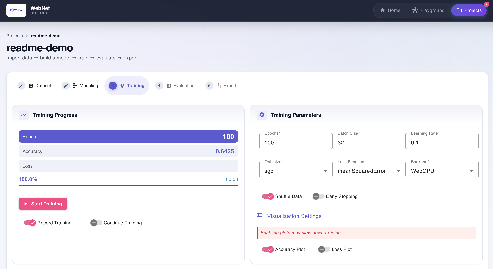
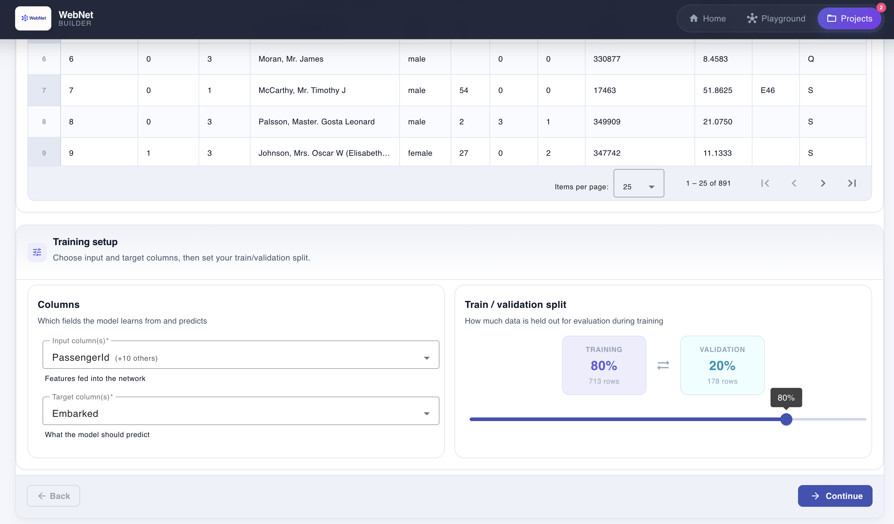
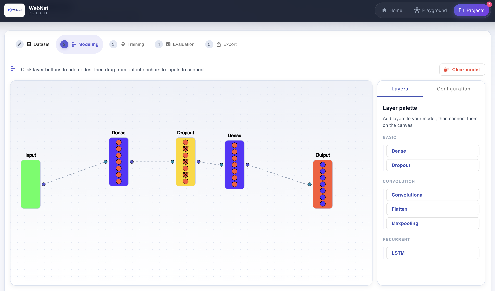
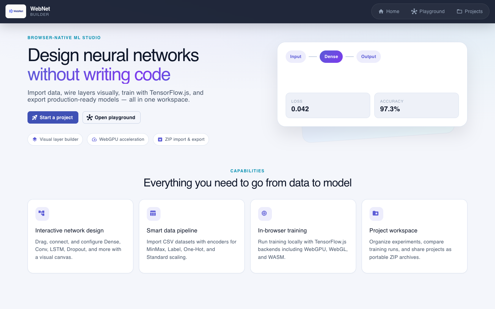
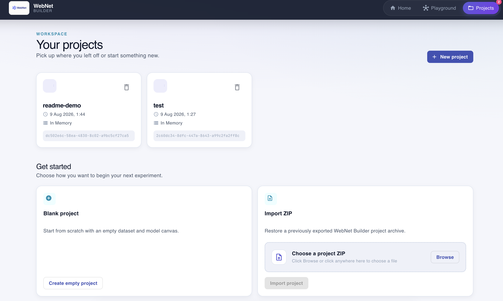

# WebNet Builder

A browser-based studio for designing, training, and evaluating neural networks without writing code. Built with Angular and TensorFlow.js, WebNet Builder keeps the full ML workflow — from CSV import to model export — on the client.



## Screenshots

| Dataset | Modeling | Training |
| --- | --- | --- |
|  |  |  |

| Home | Projects |
| --- | --- |
|  |  |

## Features

- **Guided project workflow** — Dataset, Modeling, Training, Evaluation, and Export steps in a single project, with Back/Continue navigation
- **Visual model builder** — Add Dense, Dropout, Convolution, Flatten, Max pooling, and LSTM layers; drag nodes on the canvas and wire connections between anchors
- **Dataset import & preview** — Import CSV files, preview rows in a spreadsheet-style table, configure encoders, and choose input/target columns plus a train/validation split
- **Column encoders** — MinMax, Label, One-Hot, and Standard scaling; switch between raw and processed previews
- **Playground** — Try the layer builder in a sandbox that does not save to your projects
- **In-browser training** — TensorFlow.js with WebGPU, WebGL, WASM, or CPU backends; live loss/accuracy charts optional during training
- **Evaluation** — Compare recorded training runs, inspect metrics, and run predictions
- **Project portability** — Create blank projects, import/export full projects as ZIP archives, and store copies in browser local storage

## Technology Stack

- **Frontend:** Angular 22, Angular Material
- **ML:** TensorFlow.js 4.22
- **Visualization:** D3.js, TensorFlow.js Vis
- **Data:** Danfo.js, Papa Parse (CSV)
- **Storage:** Browser local storage, JSZip for project archives

## Sample Datasets

The repository includes CSV datasets under `/data` for the guided exercises:

- Titanic survival classification (`/data/titanic`)
- Boston housing regression (`/data/boston_housing_prices`)
- Stock price time series (`/data/stock_prices`)

Import any of these into a **blank project** via the Dataset step (they are not bundled as in-app templates). See `/exercise` for step-by-step walkthroughs.

## Getting Started

Install [Task](https://taskfile.dev/) (e.g. `brew install go-task` on macOS), then from the repository root:

```bash
task dev
```

Open [http://localhost:4200](http://localhost:4200).

Run `task --list` for all available tasks.

**Requirements:** Node.js **22.22.3+**, **24.15.0+**, or **26+** (see `.nvmrc`). `task` commands auto-switch via nvm/fnm when needed. Node 23 is not supported by Angular 22.

### Manual setup (without Task)

1. Clone the repository
2. `cd frontend && npm install`
3. `npm start`
4. Open [http://localhost:4200](http://localhost:4200)

## Docker Support

Images use `/` as their base href by default. Set `BASE_HREF` when hosting under a URL prefix.

### Development

```bash
task docker:dev
```

### Production (local)

```bash
task docker:prod

# Example for a deployment under /apps/neural-network/:
BASE_HREF=/apps/neural-network/ task docker:prod
```

`BASE_HREF` must begin and end with `/`.

### Stop containers

```bash
task docker:down
```

## Project Structure

- `/frontend` — Angular application
  - `/src/app/pages` — Home, Projects, Project workflow, Playground
  - `/src/app/core` — Services, interfaces, enums
  - `/src/app/shared` — Reusable components and ML layer definitions
- `/data` — Sample CSV datasets for exercises
- `/docs/images` — Screenshots for this README
- `/exercise` — Guided learning materials
- `/nginx` — Production web server configuration

## Educational Resources

Two guided exercises live in `/exercise`:

1. **Exercise 1 — Titanic survival classification** — Binary classification with a tabular dataset
2. **Exercise 2 — Boston housing regression** — Regression to predict housing prices

Complete Exercise 1 before Exercise 2 for a progressive path through the platform.

## License

This project is part of a master thesis by Andreas Müller.
